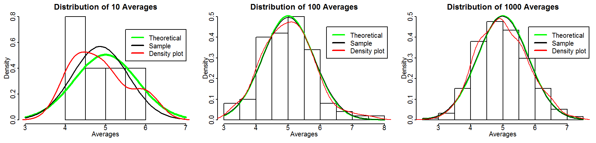

Central Limit Theorem Demonstration
========================================================
author: Sheh Lit Chang
date: Aug 25th 2016
width: 1600
height: 900

Central Limit Theorem
========================================================

The Central Limit Theorem states that the distribution of averages of independent, identically distributed variables becomes that of a standard normal as the sample size increases.

[More information about CLT](https://en.wikipedia.org/wiki/Central_limit_theorem)

Reference: Data Science Specialization Course 6, Statistical Inference, A trip to Asymtopia

Demonstration of CLT
========================================================

* An exponential distribution is used to demonstrate CLT.
* Users are allowed to choose:
  + the rate parameter 
  + how many numbers to be generated in one sample
  + how many sample size to examine the distribution of the mean of each sample
* The distribution of the mean of each sample is plotted in a histogram, and several curves are overlaid:
  + Normal curve using theoretical mean and standard deviation
  + Normal curve with sample mean and standard deviation
  + Density plot of the histogram itself
* Visit the application: [CLT Shiny App](https://shehlit.shinyapps.io/CLTheorem/)

The CLT Demonstration Shiny Application
========================================================

Suppose we have the following parameters:
  * Rate parameter = 0.2 
  * Size of 1 sample = 40
  * Number of samples = 10, 100, 1000
  * Theoretical mean = 5, Theoretical standard deviation = 0.79

We have the following histograms and fitted curves:

The CLT Demonstration Shiny Application
========================================================

From the curves, we can see that
+ the sample normal distribution curve is closer to the theoretical normal distribution curve as the sample size increases.
+ the fitted density curves resembles a normal curve when the sample size increases. 

Feel free to use change the parameters to see for yourselves!

